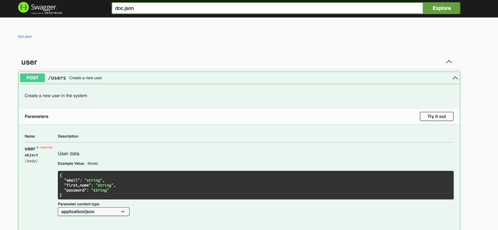

# User Register Application
## Start Application
To start the application, follow these steps:

1. Create `.env` file and fill in all fields mentioned in `.env.example`
```
PUBLIC_HOST=0.0.0.0
PORT=8080

DB_USER=
DB_PASSWORD=
DB_HOST=
DB_PORT=
DB_NAME=

DB_USER_TEST=
DB_PASSWORD_TEST=
DB_HOST_TEST=
DB_PORT_TEST=
DB_NAME_TEST=
```
You have two options to start the application: with local databases or using Docker Compose.
### Docker-compose variant
To start the application with Docker, use: `make docker-up`

To stop the application, use: `make docker-down`

### Local variant
1. Start the main and test databases locally using `make db-up`. To stop them, use: `make db-down`
2. Run Migrations, use `make migrate-up`. To roll back migrations, use: `make migrate-down`
3. Start Application, use `make local-up`

Backend reach by: `http://0.0.0.0:8080`

## Migrations

* To apply migrations, use:
`make migrate-up`

* To roll back migrations, use:
`make migrate-down`

* To create a new migration, use:
`make migration name_of_migration`

## Tests
* To run tests
`make test`

## Docs

Reach by: `http://0.0.0.0:8080/swagger/index.html`

* To update the documentation, use:
`make update-docs`